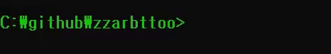

<h2>Hello world~!
</h2>

### Introduction
- 안녕하세요 기록하는 것을 좋아하는 사람(혹은 개발자)입니다
- 꾸준함에 가치를 두고 어제보다 나은 오늘을 만드는 것에 집중하고 있습니다

### Skills 
-   <b>BackEnd</b>
      - <b>JAVA</b>, python
      - Spring MVC, <b>Spring Boot</b>
      - <b>MYSQL</b>, ORACLE 
      - <b>Tomcat</b>, Wildfly 
      - <b>Maven</b>, Gradle
      - eclipse, <b>Intellij</b>, VSCode, DBeaver, Vim
      - , Git Bash

### Education

- 숭실대학교 산업정보시스템공학과 졸업(17.03~21.02)
- KH 정보교육원 웹기반 빅데이터 전문가 양성과정 수강(20.06~21.01)

### contact Me 

<b>blog</b> <a href = "https://blog.naver.com/qodbwls70"><b>기록하는 곳</b></a> 
<b>email</b> qodbwls70@naver.com

  
